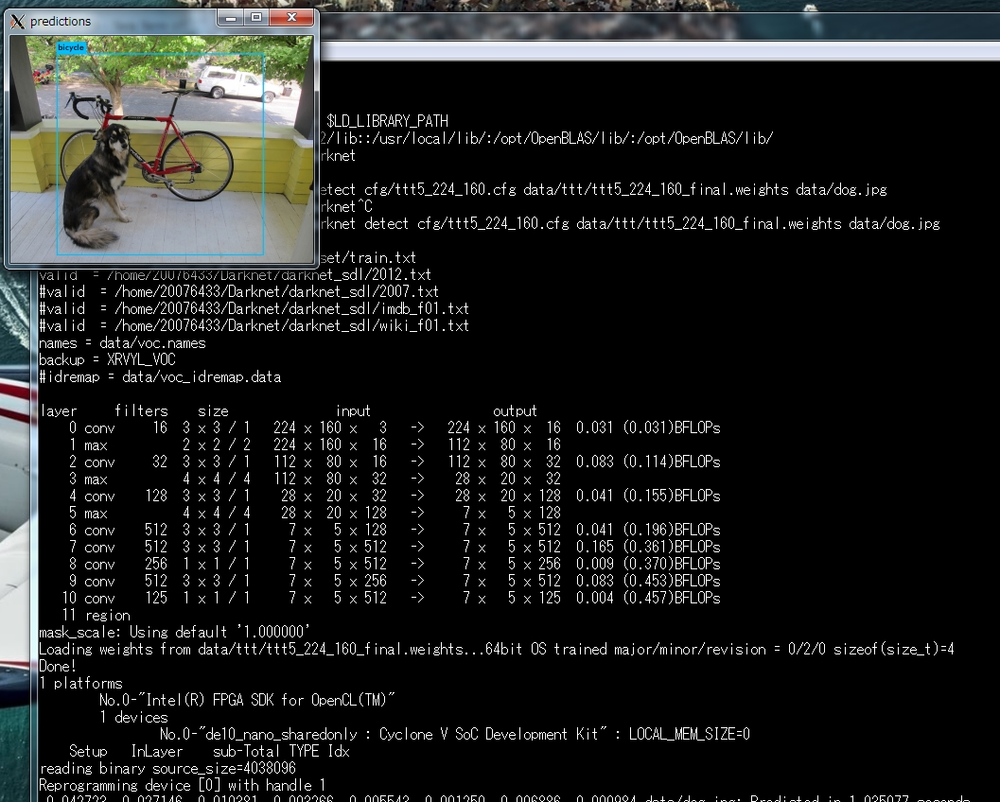

# darknet_ttt #
### What's means "_ttt"
Darknet is an open source neural network framework written in C and CUDA. Smallest YOLO model is called "tiny-yolo", but too large for my project. My project provide FPGA version YOLO with Altera-Cyclone-V-SoC.  
So, I made "tiny-yolo" more small, We are called it "tiny-tiny-tiny-yolo(_ttt)".  
[ttt5_224_160.cfg](https://github.com/k5iogura/darknet_ttt/blob/master/cfg/ttt5_224_160.cfg) means "tinny tiny tiny yolo revision.5 224x160 input image model(.cfg).

### depend on
1. Altera-Cyclone-V-SoC on [Terasic DE10Nano](https://www.terasic.com.tw/cgi-bin/page/archive.pl?Language=English&No=1046) board(Rev.C) and [BSP for Intel FPGA SDK OpenCL 16.1](https://www.terasic.com.tw/cgi-bin/page/archive.pl?Language=English&CategoryNo=205&No=1046&PartNo=4)  
2. Intel FPGA SDK for OpenCL 18.0  
3. [Linux kernel 3.18-ltsi](https://github.com/k5iogura/thinkoco-linux-socfpga). [Need linux kernel reconfigure to use UVC Camera](https://github.com/k5iogura/thinkoco-linux-socfpga).  
4. [OpenBLAS](https://github.com/xianyi/OpenBLAS)  
5. toolchain gcc (self-compiler included in sdcard.img)  

### make darknet for ARM Cortex-A9 on DE10Nano
***
DE10Nano can self-build by installed gcc, g++.  
Before making darknet_ttt, you have to make OpenBLAS by self-build on DE10Nano,  
$ git clone https://github.com/xianyi/OpenBLAS  
$ cd OpenBLAS  
$ make  
$ make install

Next step is that making darknet executable file.
On DE10Nano with "BSP for Intel FPGA SDK OpenCL 16.1" sdcard.img for kernel booting (this is console linux) console,  
$ git clone https://github.com/k5iogura/darknet_ttt  
$ cd darknet_ttt  
$ make -f Makefile.self  
You get darknet executable.

Finaly, you need kernel reconfigure to use UVC Camera. You get linux-socfpga-3.18.0-ltsi kernel zImage with following [this area](https://github.com/k5iogura/thinkoco-linux-socfpga).

### make FPGA Bitstream gemm_fpga.aocx  
***
We compile(aoc) ```gemm_ntt_jikK.aocx``` by Inter FPGA SDK for OpenCL from ```ocl/gemm_ntt_jikK.cl``` OpenCL kernel discription.  
Here, about the generic matrix operation C = A * B,  
```_ntt_``` means that Matrix A is rowmajor, B and C are colmajor.  
```_jik```  means loop order.  
```K```     means K-line Buffer.

Using ```gemm_ntt_jikK.cl``` and altera OpenCL compiler ```aoc```, issu bellow,  
$ aoc -fpc -fp-relaxed -v -report ocl/gemm_ntt_jikK.cl -o gemm_fpga.aocx  
```-fp-relaxed``` option performed good speedy GEMM operator on FPGA.  
We can get gemm_fpga.aocx as FPGA Bitstream file. Our darknet_ttt framework reads this Bitstream and reprogram FPGA Fabric at the first of process.  
About algorithm of GEMM in FPGA is [here](./files/gemm_ntt_jikK.md).

### for test on DE10Nano,  
Execution flow are, initialize OpenCL runtime and insmod aclsoc_drv.ko, set dynamic link library path and run darknet prediction demo using 1shot picture or 1MB.MP4 or UVC Camera.  Result is in X11 Window on X11 server display.

$ cd ~
$ . ./init_opencl.sh  
$ export DISPLAY=(x11 server IP address):0  
$ export LD_LIBRARY_PATH=/home/root/opencl_arm32_rte/host/arm32/lib:/usr/local/lib/:/opt/OpenBLAS/lib/  
$ ./darknet  
usage: ./darknet <function  
$ ./darknet detect cfg/ttt5_224_160.cfg data/ttt/ttt5_224_160_final.whights data/dog.jpg

***  
*result of prediction about 1shot jpeg picture.*  
  
*ttt5_224_160.cfg can predict only BYCYCLE without DOG ;-P)*
***

for MP4 Video bellow,  
$ ./darknet detector demo cfg/voc.data cfg/ttt5_224_160.cfg data/ttt/ttt5_224_160_final.whights data/1mb.mp4

finaly for UVC Camera bellow,  
$ ./darknet detector demo cfg/voc.data cfg/ttt5_224_160.cfg data/ttt/ttt5_224_160_final.whights

### training for Deep Neural Network (ttt5_224_160.cfg)
[pjreddie](https://pjreddie.com/darknet/yolov2/) recomends ensemble training method for YOLO.  
Ensemble Training perform good result of FP acuracy.  
Our training details can be sean in [Here](files/training_ttt5_224_160_model.md).

We use nVIDIA tesla GPGPU to train.
1. classification task by Imagenet data.  
ttt5_pre.cfg classification accuracy with 500 category of ImageNet dataset are,   
top-1 : 46.7%  
top-5 : 71.5%  
learning 141epoch  

2. object detection task by VOC data.  
Extract 7 layers weights from classification task's weights by darknet partial command.  
Finetune object detection task with 7 layers weights.  
ttt5_224_160.cfg perform VOC2012 IoU accuracy about 50% mAP([Officially tiny-YOLO is 57.1% mAP about VOC2007+2012](https://pjreddie.com/darknet/yolov2/)).

### Our points
***
1. For running tiny-yolo model on Cortex-A9, we need reducing floating point operations. So, we modify tiny-yolo model, input image size is 224x160, output feature map size is 7x5. And reduced convolutinal layers with minimum degraded  accuracy against original tiny-yolo model. 
2. For reducing traffic btw DDR and FPGA, use half float type ieee-754-2008. This is supported by gcc for Cortex-A9 by -mfp16-format=ieee -mfpu=neon-fp16 options.  To make darknet_ttt for intel CPU, we need "half" class of OpenEXR library and g++ compiler because gcc for intel processor does not support half floating format and OpenEXR library is written by C++ language.
3. For speed up prediction, use gemm by OpenCL optimization and BLAS CPU optimized library.
4. For speed up visibility, split Camera process and prediction process into 2threads. Camera View is infinity loop, camera view loop and prediction loop are asynchronus. By using mutex, 2loops is synchronizing only as of sending/recieving image and prediction result btn themself. 
5. We use X11 client(from OpenCV) to show result of the prediction on input image. So, We need X11 server at our demonstration. DE10Nano has HDMI output port on Board. But to use HDMI port, corresponding to IP-Module for FPGA Fabric has to be impliment in FPGA Fabric. We give up using HDMI port because DE10Nano FPGA Fabric is full by OpenCL gemm for Neural Network. 
6. im2col is generic method to reconstruct input image for suitable formula of generic matrix multiplier.  This has been tested from long time ago. But, we don't use this method. Instead of im2col, we use im2row method because im2row perform good efficiencies of GEMM operator.  Original im2row ideas is in [Parallel Multi Channel Convolution
using General Matrix Multiplication](https://arxiv.org/pdf/1704.04428.pdf) and code is on [this area](https://github.com/k5iogura/convolution-flavors).  
7. We use the idea of [folding technique](http://machinethink.net/blog/object-detection-with-yolo/).  By this technique(needing little modification of method for darknet), we can decrease the number of SqureRoot and floating point division at forwarding process. Detail is [here](files/FoldingBatchNormalization.md)    

### ttt5_224_160.cfg network convolution layer structure 

|No|Filter|size|input|output|  
|-:|-:|-:|-:|-:|
|0 conv |16|3x3x1|224x160x3|224x160x16|  
|2 conv |32|3x3x1|112x80x16|112x80x32|  
|4 conv |128|3x3x1|28x20x32|28x20x128|  
|6 conv |512|3x3x1|7x5x128|7x5x512|  
|7 conv |512|3x3x1|7x5x512|7x5x512|  
|8 conv |256|3x3x1|7x5x512|7x5x256|  
|9 conv |512|3x3x1|7x5x256|7x5x512|  
|10 conv|125|3x3x1|7x5x512|7x5x125|  

no.1, 3, 5 are muxpooling to down sampling.  

### DEMO set structure and result
***

We made DEMO set using ttt5_224_160.cfg forwarding model and using X11server as result viewer.  Forwarding process on DE10Nano(Cyclone-V-SoC), X11server on DE0Nano(Cyclone-V-SoC), connect ethernet of both Cyclone-V-SoC boards, and run!.  We can get about ```5FPS``` of prediction speed of 20 classes object detection task.  We think it's slow, but OpenCL GEMM on Cyclone-V is low power than GPGPU, we can run this DEMO with handy buttery(for iPad:-).  If you wanna be speedup, then you may use HDL and redesign whole DNN pipeline.  Notice, you should think that the access from Cyclone-V-SoC FPGA Fabric to DDR3 memory is slow. It is major reason of process speeddown.  We think that GEMM Fabric operation with OpenCL may be fast.  

### Structure

For Demo system, we are using 2 Cyclone-V-SoC Boards DE10Nano and DE0Nano.  DE10Nano is in object detection task with FPGA, DE0Nano is in X11 Server with Cortex A9. Relation btn IPaddress are bellow,    

|USB Cam|DE10Nano|ether|DE0Nano|LCD|
|:-|-|-:|-|-:|
|>Cable=>|192.168.138.2|====>|192.168.137.100|Arduino UNO-IF|
|10cm|Object Detection||X11 server|2.8"|

We have 4-Cortex-A9 CPU and 2-FPGA Fabric. 4-Cortex-A9 are in run darknet framework, USB Camera Interface, X11 server. 2-FPGA Fabric are in GEMM kernel, altvip.  We have mergin in Fabric area and CPU Power, but feature of this Demo system is low power, so we don't use all capability.  

### Reason why 2 boards needed
DE10Nano FPGA Fabric is in 2-GEMM kernels in object detection. First one is 9xN GEMM, second one 16xM GEMM, N, M is variable for Convolutinal Layer structure, ex. N=3, M=16~32.  We can not combine into one kernel for speed damage.  

### systemd setup
To automatically run our Demo system after linux boot, we setup "systemd" mechanism as service because DE10Nano employ systemd mechanism instead of "init". But DE0Nano employ "init" mechanism.  

- service description, ex. autodemo.service
```
  # cat /etc/systemd/system/autodemo.service
  [Unit]
  Description = Demo for Obect Detection
  After=local-fs.target
  ConditionPathExists=/opt/DEMO/bin

  [Service]
  ExecStart=/opt/DEMO/bin/autoexec.sh
  Restart=no
  Type=simple

  [Install]
  WantedBy=multi-user.target

  # chown root:root /etc/systemd/system/autodemo.service
  # chmod 644 /etc/systemd/system/autodemo.service
```
- command script for systemd service
```
  Here, we attempt that our darknet_ttt repository in /area51/darknetT3/  
  and intel FPGA Environment in /home/root/init_opencl.sh.  
  And ip-address of DE10Nano as darknet is 192.168.137.2,  
  ip-address of DE0Nano as X11 server ip-address is 192.168.137.100.
  
  # mkdir /opt/DEMO/bin
  # chmod 755 /opt/DEMO/bin
  # cat autoexec.sh
    #!/bin/bash
      /sbin/ifconfig eth0 192.168.137.2
      cd /area51/darknetT3/
      . /home/root/init_opencl.sh
      export DISPLAY=192.168.137.100:0
      /area51/darknetT3/darknet detector demo cfg/voc.data cfg/ttt5_224_160.cfg data/ttt/ttt5_224_160_final.weights

  # chown root:root /opt/DEMO/bin/autoexec.sh
  # chmod 755 /opt/DEMO/bin/autoexec.sh
```
- reload service
```
  # systemctl daemon-reload
  # systemctl status autodemo.service
   autodemo.service - Demo for Obect Detection
   Loaded: loaded (/etc/systemd/system/autodemo.service; disabled; vendor preset: enabled)
   Active: inactive (dead)
  
  Here, first disabled means autorun(at boot) on, next enabled means default.
```
- invoke our service temporary for testing
```
  # systemctl start autodemo.service
   [ 3039.849125] eth0: device MAC address 0a:f2:06:26:a2:fd
   ifc[ 3043.926463] stmmaceth ff702000.ethernet eth0: Link is Up - 1Gbps/Full - flow control off
   
  Here, still not autorun.
```
- setup autorun and start service after reboot
```
  # systemctl enable autodemo.serice
  # reboot
```
  
### Reference for original darknet project(pjreddie)
***
```
@misc{darknet13,
  author =   {Joseph Redmon},
  title =    {Darknet: Open Source Neural Networks in C},
  howpublished = {\url{http://pjreddie.com/darknet/}},
  year = {2013--2016}
}
```
For more information see the [Darknet project website](http://pjreddie.com/darknet).

For questions or issues please use the [Google Group](https://groups.google.com/forum/#!forum/darknet).
